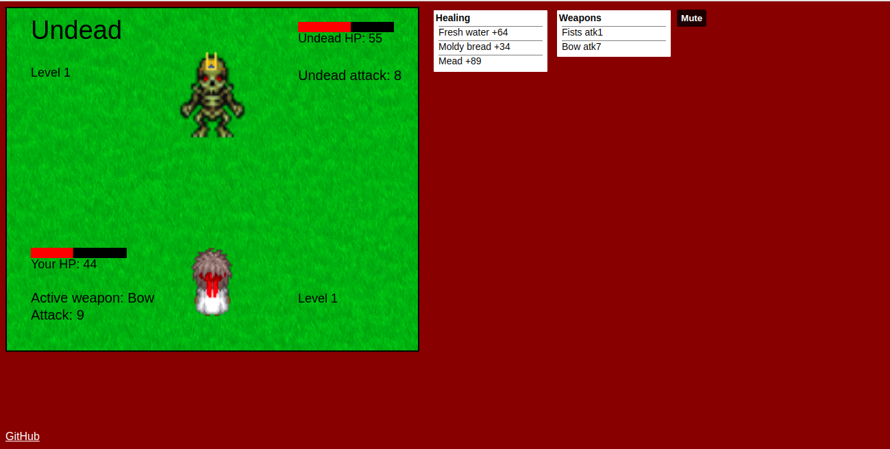

# Slayer

Play: [Slayer](https://savmus.github.io/Slayer/dist/)

Slayer is a single-player 2d RPG game, built with HTML, Canvas, CSS, and JavaScript. The files are bundled with Webpack, and the game is hosted live on GitHub Pages.

#### Instructions

Defeat all the monsters without letting your HP hit zero! Use the arrow keys to move around the map, and walk over chests to open them. Press enter to attack!



## Implementation

Slayer currently utilizes five different canvas elements. The fight canvas is hidden until the player comes into contact with a monster, and re-hidden when the fight is over. The health canvas is displayed at all times on top of the player canvas.

As the player moves along through the world, you may notice that the "camera" moves along with them. This is achieved by having three separate canvases — one for the world, one for the player, and one for the current world-view.

The world canvas is 3840x3840, and is completely drawn with monsters and chests at the beginning of the game, but is not rendered in full at any point in the game. Instead, the "viewport" canvas constantly renders a specific 600x500 view of the world depending on the player's current coordinates. The player canvas consists of simply the player image, being redrawn depending on which key is currently being pressed on your keyboard. This gives the illusion that the player is moving when they are not.

```js
    GameView.prototype.findsx = function findsx() {
        if (this.sprites.player.pos.x < 300) {
            return 0;
        } else if (this.sprites.player.pos.x > this.world.width - 300) {
            return this.world.width - 600;
        } else {
            return this.sprites.player.pos.x + (this.sprites.player.width / 2) - 315;
        }
    }
```

```js
    GameView.prototype.findsy = function findsy() {
        if (this.sprites.player.pos.y < 250) {
            return 0;
        } else if (this.sprites.player.pos.y > this.world.height - 250) {
            return this.world.height - 500;
        } else {
            return this.sprites.player.pos.y + (this.sprites.player.height / 2) - 265;
        }
    }
```

```js
    this.viewCtx.drawImage(
        this.world, 
        this.findsx(), 
        this.findsy(), 
        600, 
        500, 
        0, 
        0, 
        600, 
        500
    );
```

## Future features

* NPCs
* Currency and shopping
* Game saving